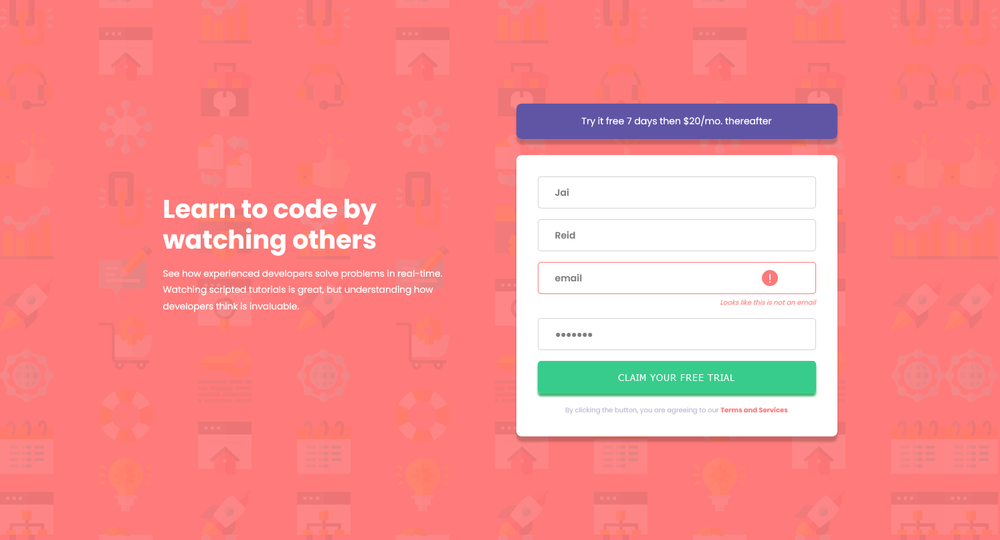

# Frontend Mentor - Intro component with sign up form solution

This is a solution to the [Intro component with sign up form challenge on Frontend Mentor](https://www.frontendmentor.io/challenges/intro-component-with-signup-form-5cf91bd49edda32581d28fd1). Frontend Mentor challenges help you improve your coding skills by building realistic projects. 

## Table of contents

- [Overview](#overview)
  - [The challenge](#the-challenge)
  - [Screenshot](#screenshot)
  - [Links](#links)
- [My process](#my-process)
  - [Built with](#built-with)
  - [What I learned](#what-i-learned)
- [Author](#author)
- [Acknowledgments](#acknowledgments)

## Overview

### The challenge

Users should be able to:

- View the optimal layout for the site depending on their device's screen size
- See hover states for all interactive elements on the page
- Receive an error message when the `form` is submitted if:
  - Any `input` field is empty. The message for this error should say *"[Field Name] cannot be empty"*
  - The email address is not formatted correctly (i.e. a correct email address should have this structure: `name@host.tld`). The message for this error should say *"Looks like this is not an email"*

### Screenshot

Add a screenshot of your solution. The easiest way to do this is to use Firefox to view your project, right-click the page and select "Take a Screenshot". You can choose either a full-height screenshot or a cropped one based on how long the page is. If it's very long, it might be best to crop it.

Alternatively, you can use a tool like [FireShot](https://getfireshot.com/) to take the screenshot. FireShot has a free option, so you don't need to purchase it. 

Then crop/optimize/edit your image however you like, add it to your project, and update the file path in the image above.

### Links

- Solution URL: [Intro Component With Sign-up Form Code](https://github.com/jaireid/Intro-Component-With-Sign-up-Form.git)
- Live Site URL: [Intro Component With Sign-up Form Site](https://jaireid.github.io/Intro-Component-With-Sign-up-Form/)

## My process

### Built with

- Semantic HTML5 markup
- Flexbox
- CSS custom properties
- CSS media queries
- Mobile-first workflow

### What I learned

I initially designed this site desktop-first and found it difficult to properly size components. So, I redesigned the website mobile-first and used breakpoints and CSS media queries. Starting with mobile-first gave me a starting template that made it easier to design and add complexity to the desktop style.

### Useful resources

- [Tailwind CSS Customizing Screens](https://tailwindcss.com/docs/screens) - This Tailwind CSS documentation about customizing screens helped me with learning breakpoints and how to use them in a project.
